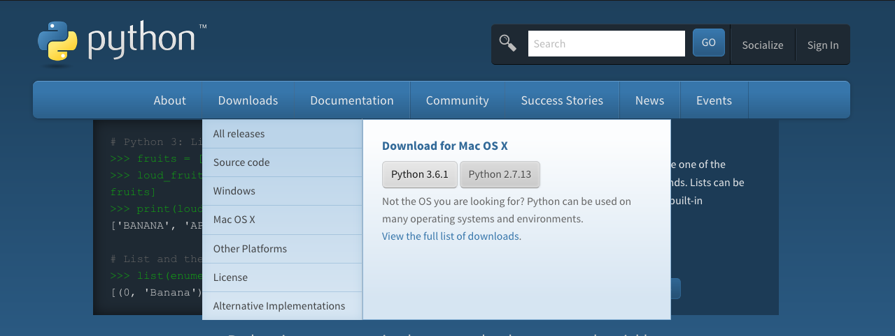
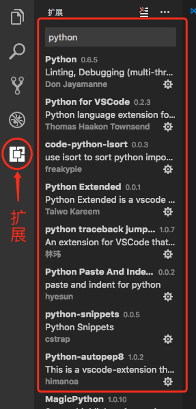
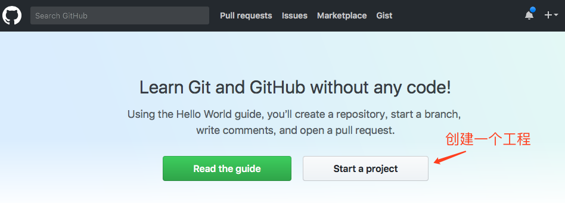
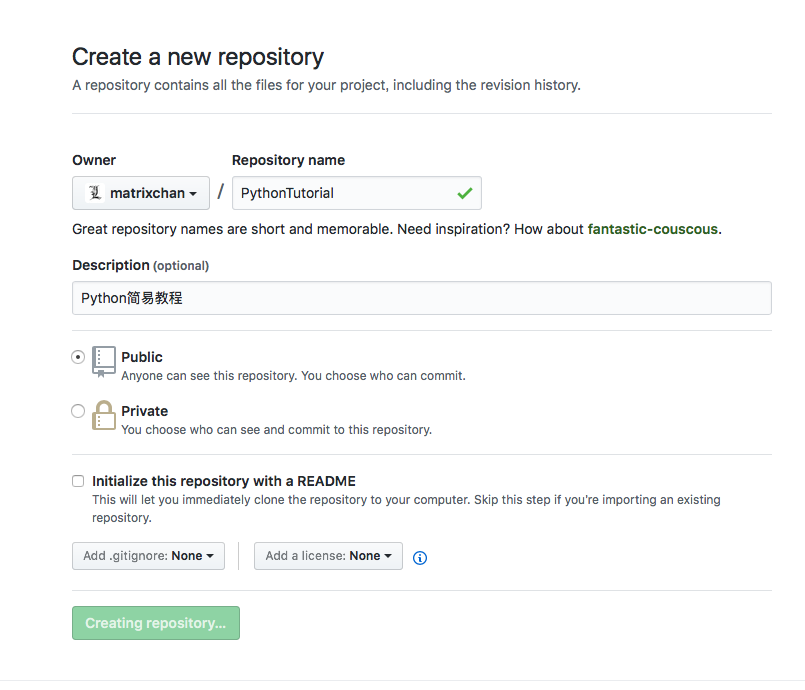
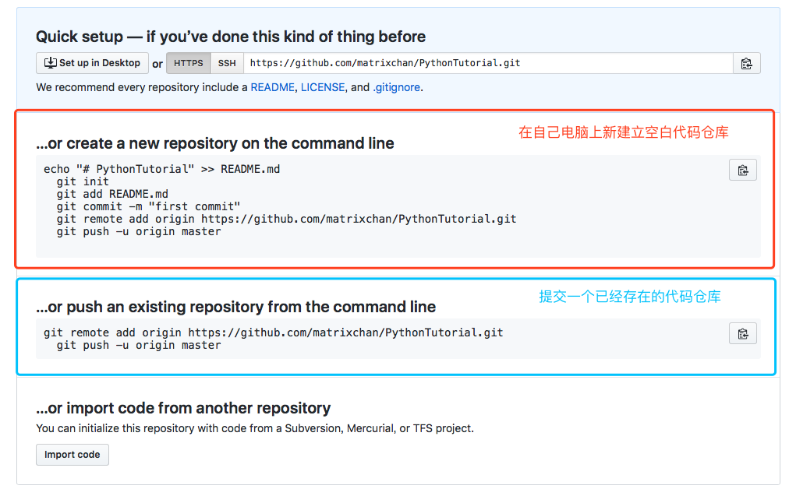
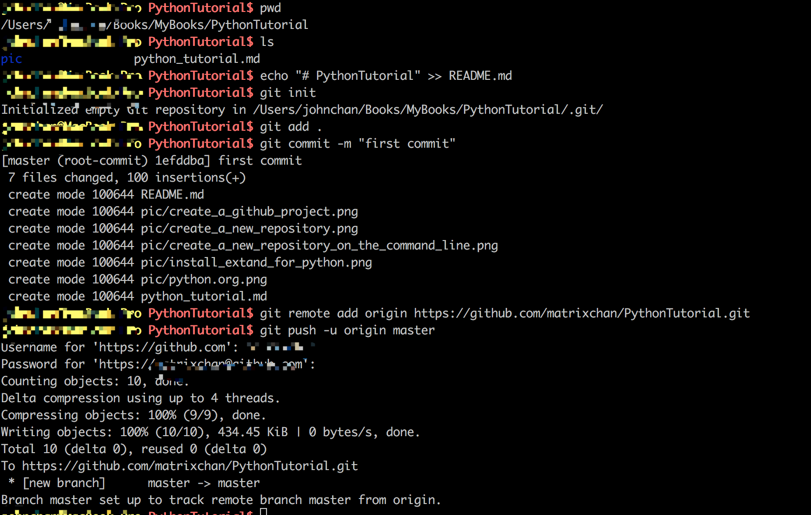
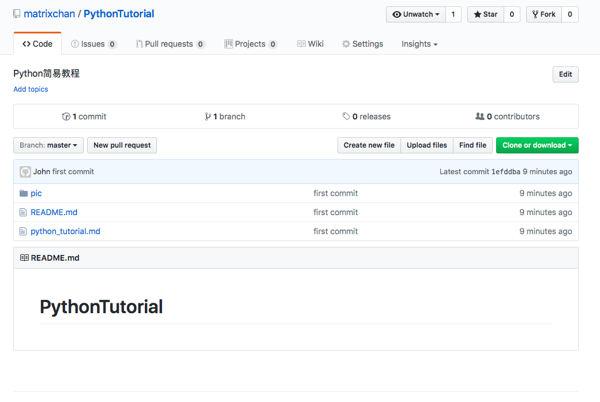
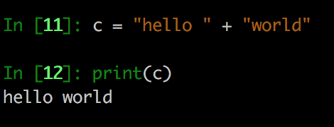
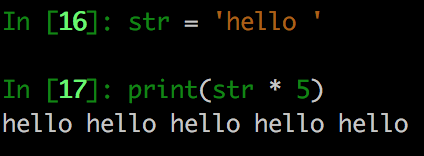

# Python 简易教程 
#### 要点
* 开发环境搭建 
* 开发工具
* 基本语法
* 函数
* 习题

		备注：本教程的Python版本为3.x
		
		
### 开发环境搭建
Python是一种解释型语言，所谓解释型语言，通俗来说是指我们编写好的代码以文本形式保存，要运行代码时候，需要该语言的解释器读取代码文本，解释为计算机能执行的指令。Python的源代码文件后缀名为.py，当要运行python的源代码时候，需要它的解释器解释执行。由于Python语言从规范到解释器都是开源的，理论上来说，任何人只要有足够水平都可以编写Python的解释器，但是此实现难度相当高。我们不需要自己去实现其解释器，可以从www.python.org官网下载安装即可。


从[官方网站 www.python.org](https://www.python.org/downloads/)根据自己所使用的电脑操作系统下载对应的python的解释器安装。




### 开发工具
##### 文本编辑器
* [Visual Studio Code](https://code.visualstudio.com/download)
	
	安装好VScode后，再安装python的扩展。
 	参考：<https://code.visualstudio.com/docs/languages/python> 	
 	如图,在输入框里面输入python，会出现相关的扩展选项，最后安装红色方框里面的扩展：
 	
 	
 	
 	

	
* [Sublime Text](http://www.sublimetext.com/)

		备注：本教程使用的编辑器为Visual Studio Code
		
##### 代码管理工具:git

		
	GitHub是一个通过Git进行版本控制的软件源代码托管服务。它提供付费和免费两种账户服务，两种账户的区别是付费账户可以创建私有代码仓库。
		

1. 到[www.github.com](https://github.com) 注册账号。
2. 创建并添加key到账号.
	```
	具体参考：https://help.github.com/articles/generating-a-new-ssh-key-and-adding-it-to-the-ssh-agent/#platform-windows
	注意：根据自己不同的操作系统平台选择相应的操作
	```
3. 创建一个工程，如图：
	
4. 接着，创建代码仓库，如图：
	
5. 初始化代码仓库，提交到刚刚在github上创建的工程中，相关指令如图：
	
	由于我们是提交新建的代码仓库，所以选择红色方框里面的命令，去初始化仓库，添加内容，已经提交到github。
	
	以下对相关指令对解释

	```
	使用命令行终端进入到本地创建的工程文件夹后执行如下指令:
	echo "# PythonTutorial" >> README.md    #创建内容为"PythonTutorial" 的README.md文件
  	git init #初始划代码仓库
  	git add README.md #把文件 README.md添加到代码仓库
  	git commit -m "first commit" ＃把文件提交到仓库
  	git remote add origin https://github.com/matrixchan/PythonTutorial.git #把现在的仓库连接到刚刚在github上创建的仓库
  	git push -u origin master ＃提交到github
		
	```  

	以下是我本机上的操作截图，有部分语句与上面不一致.	截图里面我使用了"git add .",是因为我想把该工程文件夹下所有的文件一起提交到仓库里。
	而“git add README.md ”单纯地把 README.md提交到仓库。
	

6. 提交成功后刷新工程所在的网页，会出现刚刚所提交的工程文件，如图：

	

##### 有关git的资源
github是是用git对源代码的版本进行管理，这里涉及到有关git的基本应用。

1. [git使用简易指南](books/git_guide.pdf)
2. [Git教程 -- 廖雪峰官方网站](http://www.liaoxuefeng.com/wiki/0013739516305929606dd18361248578c67b8067c8c017b000)
3. [Pro Git](books/progit-zh-v2.1.1.pdf) 
4. [Git User Manual](https://www.kernel.org/pub/software/scm/git/docs/user-manual.html)

	


### 基本语法

			
	* 标准数据类型
	* 运算符
	* 条件判断语句
	* 循环语句
	* 数据结构:列表，元组和字典
	* 函数
	
#### 标准数据类型

		标准数据类型五种:数字(Numbers)，字符型(Strings),列表(List),元组(Tuple),字典(Dictionary)。

##### 数字类型 Numbers
	Python 中有三种数字类型，分别是整数类型、浮点数类型和复数类型。

###### 整数类型

在程序中，整数的表示方法和数学上的写法一模一样，例如：1,100,0,-10等等。
有时候会使用十六进制表示整数，十六进制用0x前缀和0-9，a-f表示，例如：0xff00，0xa5b4c3d2等等。
			
###### 浮点数类型
浮点数也就是小数，之所以称为浮点数，是因为按照科学记数法表示时，一个浮点数的小数点位置是可变的，比如，1.23x109和12.3x108是完全相等的。浮点数可以用数学写法，如1.23，3.14，-9.01，等等。但是对于很大或很小的浮点数，就必须用科学计数法表示，把10用e替代，1.23x109就是1.23e9，或者12.3e8，0.000012可以写成1.2e-5，等等。

###### 复数类型
复数由实数部分和虚数部分构成，在Python中可以用a + bj,或者complex(a,b)表示。

##### Strings
字符串或串(String)是由数字、字母、下划线组成的，由单引号或者双引号括起来的一串字符。例子 'A','abc',"BCD",'你好','0','1234'等等都是字符串类型。

###### 字符串的基本操作
＋ 连接操作，连接两段字符串，例如: c = 'hello ' + "world",结果为c 为'hello world'


\*  重复操作:  



